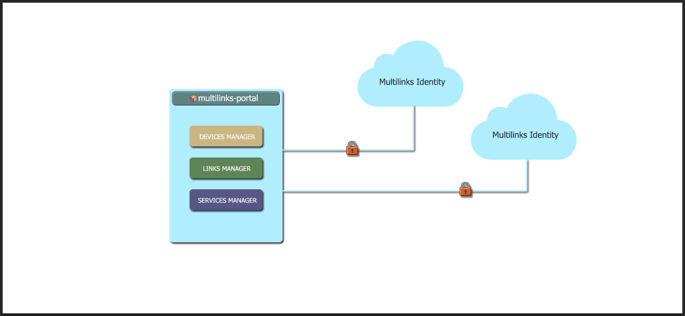

[Multilinks Portal](https://github.com/ChrisDinhNZ/MultilinksPortal/blob/master/README.md) along with [Multilinks Core](https://github.com/ChrisDinhNZ/MultilinksCore/blob/master/README.md) and [Multilinks Identity](https://github.com/ChrisDinhNZ/MultilinksIdentity/blob/master/README.md) makes up the "core" components of the Multilinks platform. You can learn more about Multilinks [here](https://github.com/ChrisDinhNZ/MultilinksCore/blob/master/ABOUT_MULTILINKS.md).

## Code of Conduct

This project and everyone participating in it is governed by the [Code of Conduct](CODE_OF_CONDUCT.md). By participating, you are expected to uphold this code. Please report unacceptable behavior to [support@multilinks.io](mailto:support@multilinks.io).

## Asking Questions

> **Note:** Please don't file an issue to ask a question. You'll get faster results by using the methods below.

* Send us an email: [support@multilinks.io](mailto:support@multilinks.io)
* Join our chat channels over on Slack: [Multilinks Workspace](https://join.slack.com/t/multilinks/shared_invite/enQtNzQxODE0NzMzMjgzLWU0ZjM1MjZiNzU1YTc1OWFjNWRlZWJmNmY0YTJmOGIzMDM1ZWJhYTliNjU3ZjM4NDMxZjc0MzY5NDNjYjllZWI)
   + Use the `#general` channel for general questions or discussion
   + Use the `#multilinks-identity` channel for questions or discussion about Multilinks Idenity project
   + Use the `#multilinks-core` channel for questions or discussion about Multilinks Core project
   + Use the `#multilinks-portal` channel for questions or discussion about Multilinks Portal project

## Contributing

You can find information about contributing to Multilinks at our [Contribution page](CONTRIBUTING.md).

## About Multilinks Portal

